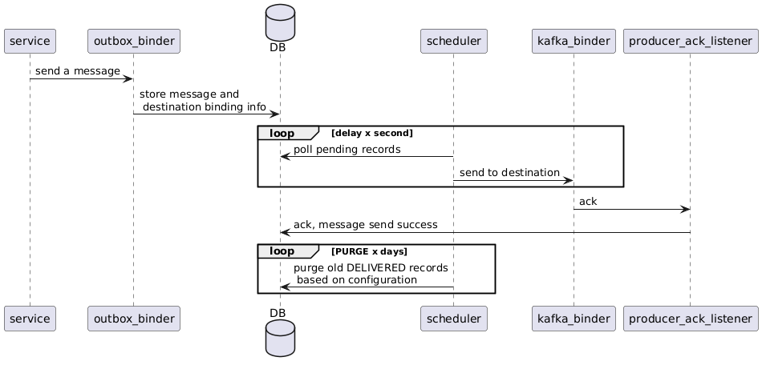
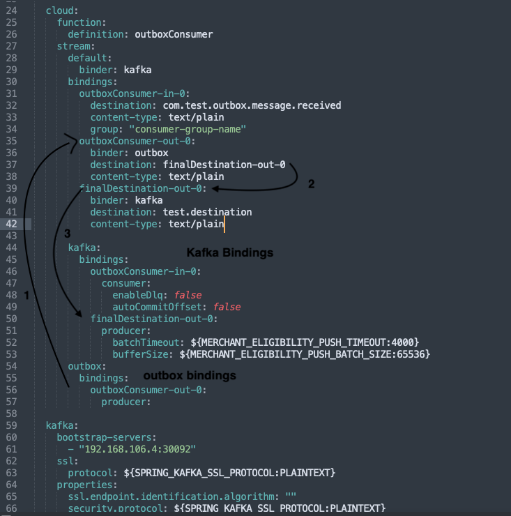

### Txn outbox ( a.k.a. Outbox pattern)
``` 
Is custom cloud stream binder that accept a message (binary or text)
& Stores it in DB to maintain trasaction and atleat once delivery guarantee.
```

#### How it works
 

#### Configuration 
 
```html
1- outbox binder bindings points to a destination(finalDestination-out-0)
2- That again refer to kafka topic destination(test.destination)
3- kafka bindings define same binding(finalDestination-out-0) as outbox binding destination (:1)
```

```text
// add dependency
implementation(group="com.cloud-stream", name="txn-outbox", version="1.0-SNAPSHOT")
```
### TODO
- db configuration and storage 
- scheduler setup
- health check for outbox binder 

#### Disadvantages 
- Does not give order guarantee
- can produce duplicates consumer should be idempotent(at least once delivery guarantee)